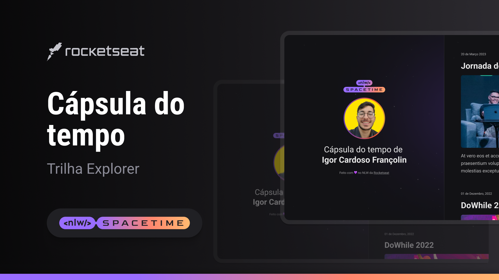

  

## 🖥️ Projeto

Esse é um projeto Web Responsivo de uma cápsula do tempo para exibir memórias em uma linha do tempo.

## 🚀 Tecnologias

Esse projeto foi desenvolvido durante o NLW da Rocketseat com as seguintes tecnologias:

- HTML
- CSS
- Git e Github

## 🏷️ Layout

Você pode visualizar o layout do projeto através
[desse link](https://www.figma.com/file/BxZq16VrkzIkO9YnvPFxR1/Minha-Cápsula-do-tempo-•-Trilha-Explorer?type=design&node-id=311-30&t=yrPIiN9s6lro08vc-0).
É necessário ter uma conta no [figma](https://www.figma.com/)
